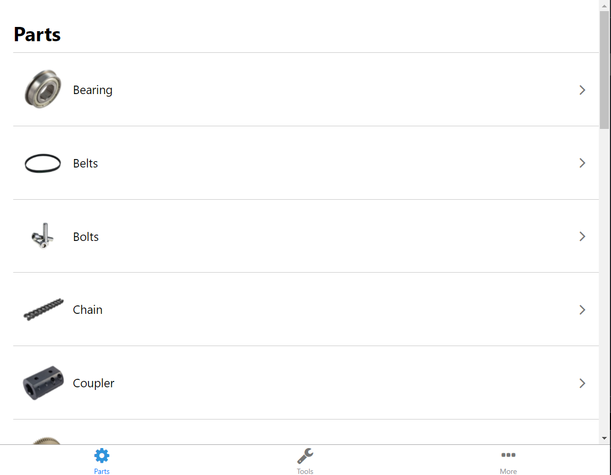
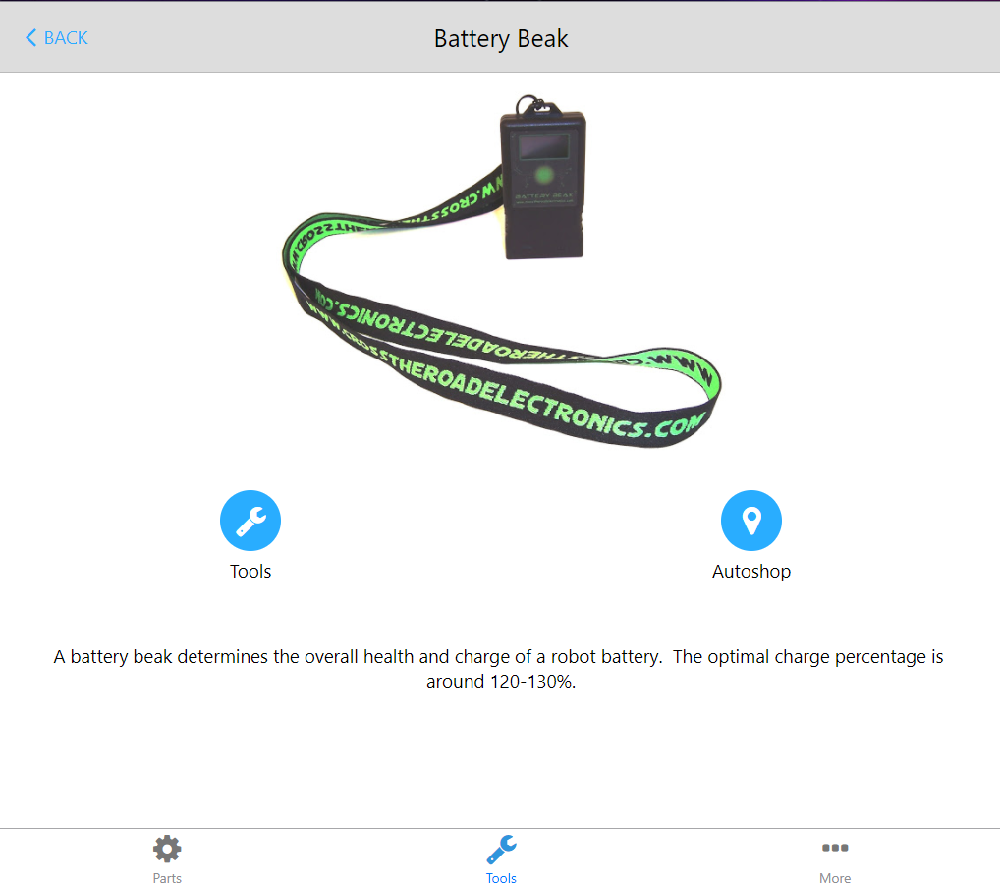

# Robotics Parts App

This repository hosts our "*Parts App*", made by **Team 2638**.

This app was made using React Native. It's a cheatsheet for parts/tools that are commonly used when building our robots!

<details>
<summary>Screenshots</summary>
<br>



</details>

## Setup

```
npm install
npm install -g expo-cli
expo start --web --localhost
```